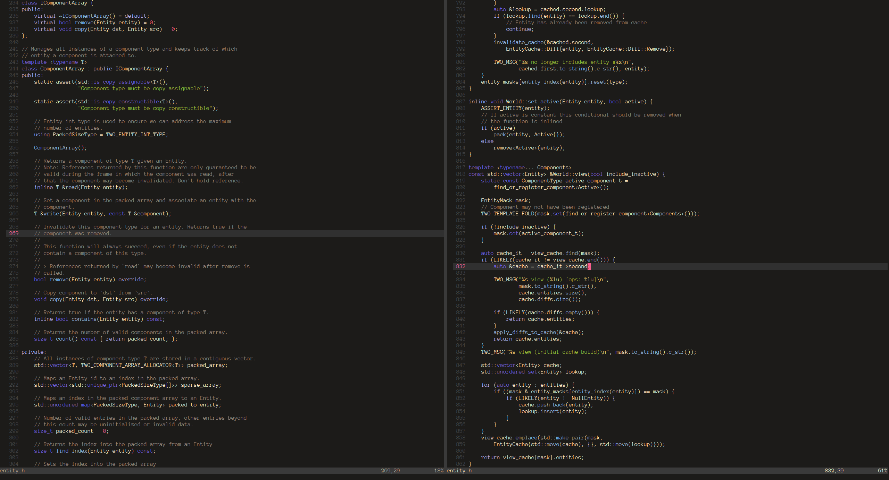
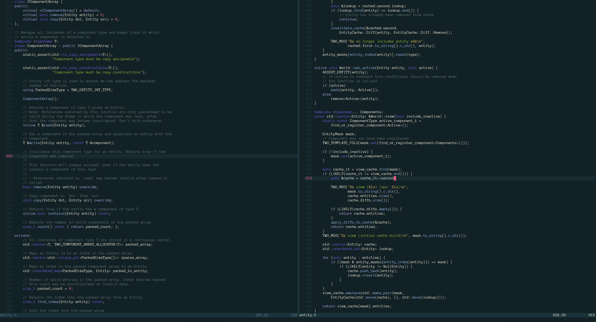
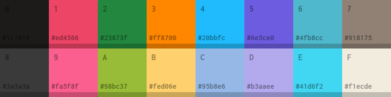

# Iridium

Warm high contrast color scheme for vim.

## Installation

Place `iridium.vim` into your `~/.vim/colors` directory, or simply use a plug-in manager like [Plug](https://github.com/junegunn/vim-plug):

```VimL
Plug 'stillwwater/vim-iridium'

" Enable true color
if has('termguicolors')
  set termguicolors
endif
```




## Options
```VimL
" 'warm' or 'cold' backgrounds
let g:iridium_variant = "warm"

" if enabled, use fewer colors
let g:iridium_classic = 0

" use vsplit background color
let g:iridium_solid_vsplit = 1

" colorful comments
let g:iridium_bright_comments = 0
```

---



Based on [vim-srcery](https://github.com/srcery-colors/srcery-vim) and [vim-colors-pencil](https://github.com/preservim/vim-colors-pencil)

